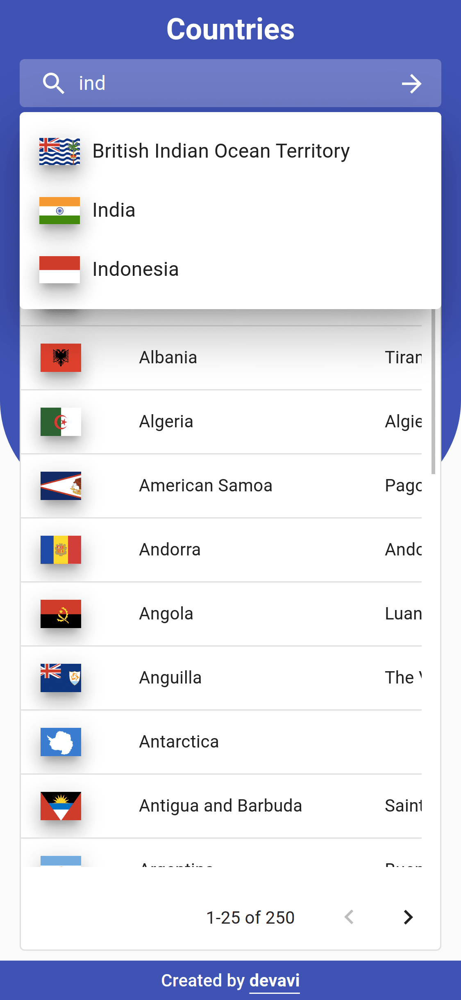

# Countries

A Next.js Web Application built with the [REST Countries](https://restcountries.eu)'s REST API

## App

Go to the _[app](https://countries-devavi.vercel.app/)_

## Features

### Table View

You can view all the countries in a user-friendly table view.

    

### Sorting

You can apply sorting, ascending or descending, to any column by clicking on the column's header.

    

    

### Search

You can search for any country by typing in the name in the search bar or by selecting one from the auto complete dropdown.

    

    

### Responsive

The web page is fully responsive for desktop, tablet, and mobile.

    
    
    
    

# Documentation

## global/countries/actions

### Functions

#### countriesError

▸ **countriesError**(`error`: _string_): _CountriesErrorAction_

The action dispatched when the countries are failed to be fetched from API

##### Parameters:

| Name    | Type     | Description                               |
| :------ | :------- | :---------------------------------------- |
| `error` | _string_ | The error occured while fetching from API |

**Returns:** _CountriesErrorAction_

Returns the CountriesErrorAction

Defined in: global/countries/actions.ts:32

---

#### countriesLoaded

▸ **countriesLoaded**(`countries`: _Country_[]): _CountriesLoadedAction_

The action dispatched when the countries are fetched from API

##### Parameters:

| Name        | Type                                           | Description                            |
| :---------- | :--------------------------------------------- | :------------------------------------- |
| `countries` | [_Country_](#classesmodels_countrycountrymd)[] | The list of countries fetched from API |

**Returns:** [_CountriesLoadedAction_](#interfacesglobal_countries_typescountriesloadedactionmd)

Returns the CountriesLoadedAction

Defined in: global/countries/actions.ts:16

## global/countries/reducers

### Functions

#### countriesReducer

▸ **countriesReducer**(`state?`: _CountriesState_, `action`: _CountriesActionType_): _CountriesState_

##### Parameters:

| Name     | Type                  | Description                                     |
| :------- | :-------------------- | :---------------------------------------------- |
| `state`  | _CountriesState_      | The initial state provided to countries reducer |
| `action` | _CountriesActionType_ | The actions this reducer will react to          |

**Returns:** _CountriesState_

Returns the countries state

Defined in: global/countries/reducers.ts:23

## hooks/useCountriesTable

### Functions

#### default

▸ **default**(`query`: _RouteQuery_): CountriesTableValues

A custom React hook for building rows and columns
for the Countries Table

##### Parameters:

| Name    | Type         | Description                                         |
| :------ | :----------- | :-------------------------------------------------- |
| `query` | _RouteQuery_ | The route query with the URL for filtering the rows |

**Returns:** CountriesTableValues

The values to be used in the Countries table

Defined in: hooks/useCountriesTable.ts:40

## utils/deserializeState

### Functions

#### default

▸ **default**(`state`: _SerializedRootState_): _RootState_

Deserializes a serialized redux state for client-side

##### Parameters:

| Name    | Type                  | Description                |
| :------ | :-------------------- | :------------------------- |
| `state` | _SerializedRootState_ | The serialized redux state |

**Returns:** _RootState_

Returns a deserialized redux state

Defined in: utils/deserializeState.ts:10

## utils/fetchCountries

### Functions

#### default

▸ **default**(): _Promise_<_Country_[]\>

Fetches the countries list from API endpoint.

**Returns:** _Promise_<_Country_[]\>

Returns an array of Country object in a promise

Defined in: utils/fetchCountries.ts:10

## utils/getColumns

### Functions

#### default

▸ **default**(): ColDef[]

Prepares the columns for the countries table

**Returns:** ColDef[]

Returns an array of column definitions

Defined in: utils/getColumns.tsx:10

## utils/getRows

### Functions

#### default

▸ **default**(`countries`: _Country_[], `query`: _SearchQuery_): _ICountry_[]

Prepares, and filters if search query provided, the rows for the countries table

##### Parameters:

| Name        | Type          | Description                    |
| :---------- | :------------ | :----------------------------- |
| `countries` | _Country_[]   | The list of countries          |
| `query`     | _SearchQuery_ | The search query for filtering |

**Returns:** _ICountry_[]

Returns the list of countries as rows

Defined in: utils/getRows.ts:12

## utils/mergeSearchQuery

### Functions

#### default

▸ **default**(`input`: _string_, `query`: _ParsedUrlQuery_): _string_

Merges the search input with the existing url query

##### Parameters:

| Name    | Type             | Description                                              |
| :------ | :--------------- | :------------------------------------------------------- |
| `input` | _string_         | the input value to be merged with the existing url query |
| `query` | _ParsedUrlQuery_ | the existing url query                                   |

**Returns:** _string_

Returns the merged query as string

Defined in: utils/mergeSearchQuery.ts:11

## utils/mergeSortingQuery

### Functions

#### default

▸ **default**(`sortingQuery`: _SortingQuery_, `query`: _ParsedUrlQuery_): _string_

Merges the sorting query with the existing url query

##### Parameters:

| Name           | Type             | Description                                                |
| :------------- | :--------------- | :--------------------------------------------------------- |
| `sortingQuery` | _SortingQuery_   | the sorting query to be merged with the existing url query |
| `query`        | _ParsedUrlQuery_ | the existing url query                                     |

**Returns:** _string_

Returns the merged query as string

Defined in: utils/mergeSortingQuery.ts:12

## utils/serializeState

### Functions

#### default

▸ **default**(`state`: _RootState_: _SerializedRootState_)

Serializes the redux state for server-side

##### Parameters:

| Name    | Type        | Description                   |
| :------ | :---------- | :---------------------------- |
| `state` | _RootState_ | The un-serialized redux state |

**Returns:** _SerializedRootState_

Returns a serialized redux state

Defined in: utils/serializeState.ts:9

## utils/sortModelToSortQuery

### Functions

#### default

▸ **default**(`model`: SortModel): _SortingQuery_

Converts a sort model into a sorting query

##### Parameters:

| Name    | Type      | Description                    |
| :------ | :-------- | :----------------------------- |
| `model` | SortModel | The sort model to be converted |

**Returns:** _SortingQuery_

Returns the converted sorting query

Defined in: utils/sortModelToSortQuery.ts:11

## utils/sortQueryToSortModel

### Functions

#### default

▸ **default**(`query`: _SortingQuery_): SortModel

Converts a sorting query into a sort model

##### Parameters:

| Name    | Type           | Description                       |
| :------ | :------------- | :-------------------------------- |
| `query` | _SortingQuery_ | The sorting query to be converted |

**Returns:** SortModel

Returns the converted sort model

Defined in: utils/sortQueryToSortModel.ts:11
