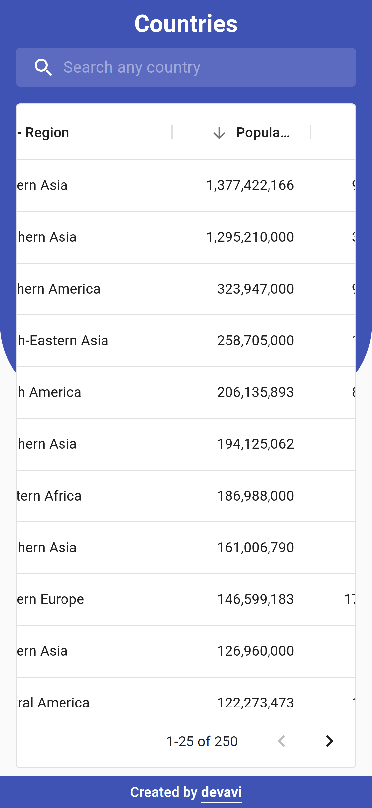

# Countries

A Next.js Web Application built with the [REST Countries](https://restcountries.eu)'s REST API

## Features

### Table View

You can view all the countries in a user-friendly table view.

    

### Sorting

You can apply sorting, ascending or descending, to any column by clicking on the column's header.

    

    

### Search

You can search for any country by typing in the name in the search bar or by selecting one from the auto complete dropdown.

    

    

### Responsive

The web page is fully responsive for desktop, tablet, and mobile.

    
    
    
    

